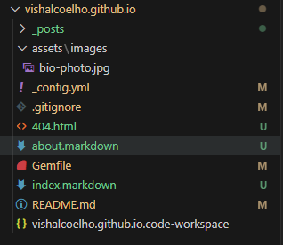
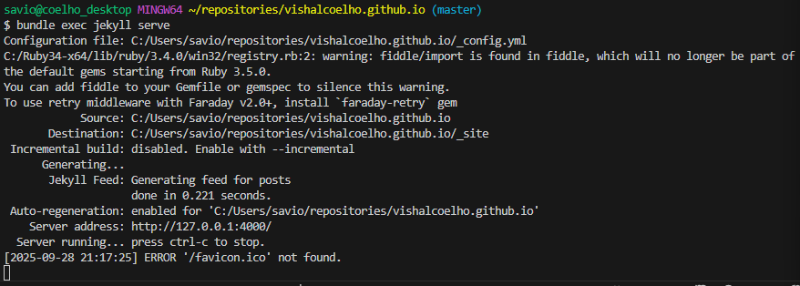

# Minimal Mistakes remote theme starter

Click [**Use this template**](https://github.com/mmistakes/mm-github-pages-starter/generate) button above for the quickest method of getting started with the [Minimal Mistakes Jekyll theme](https://github.com/mmistakes/minimal-mistakes).

Contains basic configuration to get you a site with:

- Sample posts.
- Sample top navigation.
- Sample author sidebar with social links.
- Sample footer links.
- Paginated home page.
- Archive pages for posts grouped by year, category, and tag.
- Sample about page.
- Sample 404 page.
- Site wide search.

Replace sample content with your own and [configure as necessary](https://mmistakes.github.io/minimal-mistakes/docs/configuration/).

---

## Troubleshooting

If you have a question about using Jekyll, start a discussion on the [Jekyll Forum](https://talk.jekyllrb.com/) or [StackOverflow](https://stackoverflow.com/questions/tagged/jekyll). Other resources:

- [Ruby 101](https://jekyllrb.com/docs/ruby-101/)
- [Setting up a Jekyll site with GitHub Pages](https://jekyllrb.com/docs/github-pages/)
- [Configuring GitHub Metadata](https://github.com/jekyll/github-metadata/blob/master/docs/configuration.md#configuration) to work properly when developing locally and avoid `No GitHub API authentication could be found. Some fields may be missing or have incorrect data.` warnings.

---

## Getting Started

### Software Install
1. Go to [Ruby Installer]([https://](https://rubyinstaller.org/downloads/)) and get the latest rubyinstaller + devkit for Windows
1. Run the installation with the default settings; when it starts to install the MSYS toolchain, choose option 3: MSYS and MSYS2. Once the install is done, it'll ask the same set of questions again, hit ENTER to exit out
1. Since i will be using the bash terminal to run ruby, modify the `.bashrc` to include the newly installed ruby binaries in the system path

    ```bash
    export PATH=${PATH}:/c/Ruby34-x64/bin
    ```

1. run `gem update`
1. Install `jekyll` and 'bundler`
    ```bash
    $ gem install jekyll bundler
    ```
1. run `jekyll -v`, you should get a response like `jekyll 4.4.1`

## Creating a Jekyll Project
1. We are going to force jekyll to create a page in our github webpage repository, `vishalcoelho.github.io` in my case.
   1. cd into the root of the repo
   1. Create a new site
   ```bash
    $ jekyll new --skip-bundle .
    **Conflict**: C:/Users/savio/repositories/vishalcoelho.github.io exists and is not empty.
    Ensure C:/Users/savio/repositories/vishalcoelho.github.io is empty or else try again with `--force` to proceed and overwrite any files.
   ```
   :warning: It's complaining about the repo being empty, use `--force`

   ```bash
    $ jekyll new --skip-bundle . --force
    New jekyll site installed in C:/Users/savio/repositories/vishalcoelho.github.io.
    Bundle install skipped.
   ```
   

1. Edit the *Gemfile*:
   1. comment `gem "jekyll", "~> 4.4.1", GitHub is currently pinned to v3
   1. Uncomment `gem "github-pages", group: :jekyll_plugins` and add the version for github-pages, which you can fine on [GitHub versions](https://pages.github.com/versions/)
      `gem "github-pages", "~>232", group: :jekyll_plugins`
   1. Run
        ```bash
        $ bundle install
        [DEPRECATED] Platform :mingw, :x64_mingw, :mswin is deprecated. Please use platform :windows instead.
        Fetching gem metadata from https://rubygems.org/...........
        Resolving dependencies...
        ...stuff...
        Bundle complete! 7 Gemfile dependencies, 100 gems now installed.
        Use `bundle info [gemname]` to see where a bundled gem is installed.
        ```

1. Verify changes in `Gemfile.lock` then add that file to `.gitignore`

## Visualizing changes locally

1. `bundle exec jekyll serve` should serve up the site locally


1. `Ctrl+C` to shut down the server